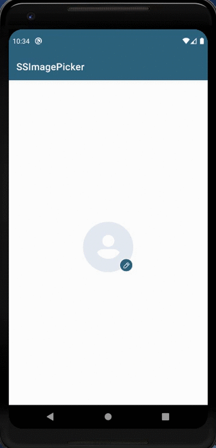
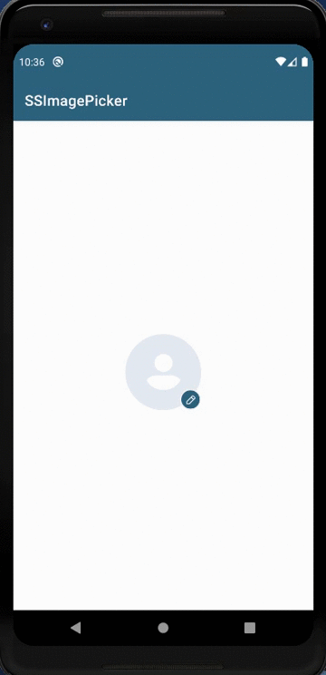

# 📸SSImagePicker 

[](https://developer.android.com/studio/)
[](https://android-arsenal.com/api?level=19)


Easy to use and configurable library to **Pick an image from the Gallery or Capture image using Camera**.

You can easily select image from camera and gallery and upload it wherever you want. I have created this library to simplify pick or capture image feature.

# Features : 

* Capture Image Using Camera
* Pick Image From Gallery
* Handle Runtime Pemission For Storage And Camera
* ImagePicker Bottomsheet 
* Retrieve Image Result In Uri Format
* Crop Image (Coming Soon...)
* Customise Image Picker BottomSheet (Coming Soon...)

# 🎬Preview

| Capture Image Using Camera | Pick Image From Gallery |
|--|--|
|  |  |

# How it works:

1. Add it in your root build.gradle at the end of repositories:

```
    allprojects {
    		repositories {
    			...
    			maven { url 'https://jitpack.io' }
    		}
    	}
```
2. Add the dependency in your app's build.gradle file

```
    dependencies {
    	        implementation 'com.github.SimformSolutionsPvtLtd:SSImagePicker:-SNAPSHOT'
    	}
```
3. Use ImagePicker Bottomsheet To Choose Option For Pick Image From Gallery Or Camera

```
    val fragment = ImagePickerBottomsheet()
    fragment.show(FragmentManager, String) 
```
4. Allow Camera And Storage Permission To Pick Image And Send Your onRequestPermissionsResult To ImagePickerActivity

```
    override fun onRequestPermissionsResult(requestCode: Int, permissions: Array<out String>, grantResults: IntArray) 
    {
         imagePicker.onRequestPermissionsResult(requestCode, permissions, grantResults)
    }
```

5. Call ImagePickerActivityClass To Handle Camera, Gallery Click And Permission Result. Pass Context, Activity And Request Permission Result Callback:

```
    var imagePicker = ImagePickerActivityClass(Context,Activity,onResult_Callback)
```
6. To Capture Image From Camera Use takePhotoFromCamera()

```
    imagePicker.takePhotoFromCamera()
```
7. To Pick Image From Gallery Use choosePhotoFromGallary()

```
    imagePicker.choosePhotoFromGallary()
```

8. You Will Get Image Result In Uri Format In returnString() And Customize It To Upload 

```
     override fun returnString(item: Uri?) {
            **Here You Will Get Your Image Result In Uri Format**
        }
```
## Find this library useful? :heart:
Support it by joining __[stargazers](https://github.com/SimformSolutionsPvtLtd/SSImagePicker/stargazers)__ for this repository. :star:

## License

```
Copyright 2020 Simform Solutions

 Licensed under the Apache License, Version 2.0 (the "License");
 you may not use this file except in compliance with the License.
 You may obtain a copy of the License at
    http://www.apache.org/licenses/LICENSE-2.0
 Unless required by applicable law or agreed to in writing, software
 distributed under the License is distributed on an "AS IS" BASIS,
 WITHOUT WARRANTIES OR CONDITIONS OF ANY KIND, either express or implied.
 See the License for the specific language governing permissions and limitations under the License.
```