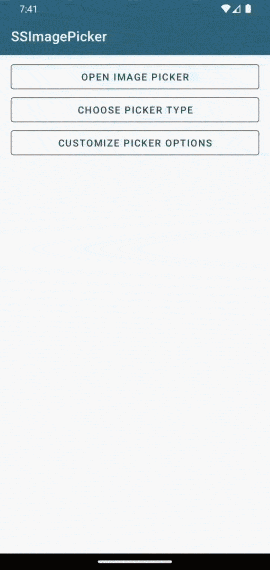
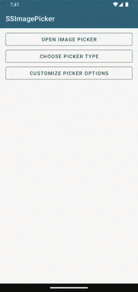
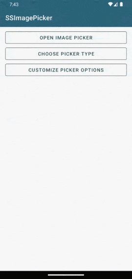

# 📸 SSImagePicker

[](https://jitpack.io/#SimformSolutionsPvtLtd/SSImagePicker)
[](https://android-arsenal.com/api?level=21)
[](https://kotlinlang.org)
[](https://androidweekly.net/issues/issue-473)
[]( https://android-arsenal.com/details/1/8243 )

Easy to use and configurable library to **Pick multiple images from the Gallery or Capture an image
using Camera with maximum size, extension, crop, rotate, zoom and compress features**.

* You can easily select image from camera and gallery and upload it wherever you want. We have
  created this library to simplify pick or capture image feature.
* Handled permissions for camera and gallery, also supports scoped storage.
* Returns contentUri of selected image.
* Easy to use and supports all major devices.
* Support for
  new [Photo Picker](https://developer.android.com/training/data-storage/shared/photopicker) for
  Android 11+.

# :zap: Features :

* Capture Image Using Camera
* Pick Image From Gallery
* Multiple image pick support with pick limit
* Handle Runtime Permission For Storage And Camera
* ImagePicker Options Bottom Sheet
* Retrieve Image Result In Uri Format
* Crop Image with support of free hand cropping
* Rotate Image
* Image Zoom In, Zoom Out
* Size filter for images
* Extension filter for images
* Compress image
* Customize entire Image Picker screen UI with your own options and style
* New Photo picker for the Android 11+.

# 🎬Preview

| Camera Picker               | Gallery Picker               | Multi Selection Gallery Picker        |
|-----------------------------|------------------------------|---------------------------------------|
|  |  |  |

| Picker Option Bottom Sheet               | Crop Options               | Extension Options               |
|------------------------------------------|----------------------------|---------------------------------|
|  |  |  |

| System Photo Picker (Android 11+) |
|-----------------------------------|
|  |

# :books: How it works:

1. Gradle Dependency

* Add the JitPack repository to your project's build.gradle file
    - For Gradle version 5.x.x or less

   ```kotlin
        allprojects {
            repositories {
                ...
    	         maven { url = "https://jitpack.io" }
            }
        }
   ```
    - For latest Android Studio, in **settings.gradle** file
      inside **`dependencyResolutionManagement`** block

   ```kotlin
        dependencyResolutionManagement {
            repositories {
                ...
                 maven { url = "https://jitpack.io" }
            }
        }
    ```

* Enable data binding feature in your app's build.gradle
  file [(More Details)](https://developer.android.com/topic/libraries/data-binding/start#build_environment)
  .
    ```kotlin
        android {
            ...
            buildFeatures {
                dataBinding=true
            }
        }
    ```

* Add the dependency in your app's build.gradle file

    ```kotlin
        dependencies {
            implementation("com.github.SimformSolutionsPvtLtd:SSImagePicker:2.0")
        }
    ```

2. Add ImagePickerActivity into your AndroidManifest.xml. **`SSImagePicker`** is default theme for
   image picker activity. If you want to set custom theme check
   out [customization guide](docs/picker_ui_customization.md). Make sure to add
   the **`android:configChanges`** to handle the rotation.

```xml

<activity android:name="com.app.imagepickerlibrary.ui.activity.ImagePickerActivity"
    android:configChanges="orientation|screenSize" android:theme="@style/SSImagePicker" />
```

3. If you want to use Picker options bottom sheet then
   implement **`SSPickerOptionsBottomSheet.ImagePickerClickListener`** in your fragment or
   activity. **`onImageProvider`** method will give the selected provider type.

```kotlin
    val pickerOptionBottomSheet = SSPickerOptionsBottomSheet.newInstance()
pickerOptionBottomSheet.show(supportFragmentManager, "tag")
....
override fun onImageProvider(provider: ImageProvider) {
    when (provider) {
        ImageProvider.GALLERY -> {
            //Open gallery
        }
        ImageProvider.CAMERA -> {
            //Open camera
        }
        ImageProvider.NONE -> {}
    }
}
```

4. Open Image Picker from activity or fragment via registering the image picker. It will give object
   of **`ImagePicker`** class.

```kotlin
    private val imagePicker: ImagePicker by lazy {
    registerImagePicker(this)
}

override fun onCreate(savedInstanceState: Bundle?) {
    super.onCreate(savedInstanceState)
    ...
}

//To display the picker screen call open method on image picker object passing the picker type.
imagePicker.open(PickerType.GALLERY)
```

5. Add customization to image picker via the image picker object. Checkout all the methods and
   default values for customization from the [picker config customization](docs/picker_config.md)
   section.

```kotlin
    imagePicker
    .title("My Picker")
    .multipleSelection(enable = true, maxCount = 5)
    .showCountInToolBar(false)
    .showFolder(true)
    .cameraIcon(true)
    .doneIcon(true)
    .allowCropping(true)
    .compressImage(false)
    .maxImageSize(2)
    .extension(PickExtension.JPEG)
imagePicker.open(PickerType.GALLERY)
```

6. To get result in activity or fragment implement **`ImagePickerResultListener`**.

```kotlin
    class MainActivity : AppCompatActivity(), ImagePickerResultListener {
    ...
}
```

7. Single Selection and the image captured from camera will be received in
   **`onImagePick(uri: Uri?)`** callback.

```kotlin
    override fun onImagePick(uri: Uri?) {
    //Do something with uri
}
```

8. Multiple Selection uris will be received in **`onMultiImagePick(uris: List<Uri>?)`** callback.

```kotlin
    override fun onMultiImagePick(uris: List<Uri>?) {
    //Do something with uris
}
```

# :art: Customization

- Customize picker config for different available options
    - [:books: Picker Config Guide](docs/picker_config.md)
- Customize UI of picker screen with different style attributes
    - [:books: Picker Screen UI Guide](docs/picker_ui_customization.md)
- Customize UI of picker options bottom sheet with different style attributes
    - [:books: Picker Options Bottom Sheet Guide](docs/options_bottom_sheet_customization.md)

# :pencil: Permissions

**SSImagePicker** Uses following permissions to display images. For
system [Photo Picker](https://developer.android.com/training/data-storage/shared/photopicker) on
Android 11+ no permission is required.

* API **21(Android 5)** to API **32(Android 12L)**: `android.permission.READ_EXTERNAL_STORAGE`
* API **33(Android 13)** onwards: `android.permission.READ_MEDIA_IMAGES`

# :rocket: Migration

- Checkout the migration [guide](docs/migration.md) for migration to the latest version.

## Other Library used:

* __[UCrop Library](https://github.com/Yalantis/uCrop)__

## Find this library useful? :heart:

Support it by
joining __[stargazers](https://github.com/SimformSolutionsPvtLtd/SSImagePicker/stargazers)__ for
this repository. :star:

## 🤝 How to Contribute

Whether you're helping us fix bugs, improve the docs, or a feature request, we'd love to have you! :
muscle:

Check out our [**Contributing
Guide**](https://github.com/SimformSolutionsPvtLtd/SSImagePicker/blob/master/CONTRIBUTING.md) for
ideas on contributing.

## Bugs and Feedback

For bugs, feature requests, and discussion please
use [GitHub Issues](https://github.com/SimformSolutionsPvtLtd/SSImagePicker/issues).

## Awesome Mobile Libraries

- Check out our other
  available [awesome mobile libraries](https://github.com/SimformSolutionsPvtLtd/Awesome-Mobile-Libraries)

## License

```
MIT License

Copyright (c) 2022 Simform Solutions

Permission is hereby granted, free of charge, to any person obtaining a copy
of this software and associated documentation files (the "Software"), to deal
in the Software without restriction, including without limitation the rights
to use, copy, modify, merge, publish, distribute, sublicense, and/or sell
copies of the Software, and to permit persons to whom the Software is
furnished to do so, subject to the following conditions:

The above copyright notice and this permission notice shall be included in all
copies or substantial portions of the Software.

THE SOFTWARE IS PROVIDED "AS IS", WITHOUT WARRANTY OF ANY KIND, EXPRESS OR
IMPLIED, INCLUDING BUT NOT LIMITED TO THE WARRANTIES OF MERCHANTABILITY,
FITNESS FOR A PARTICULAR PURPOSE AND NONINFRINGEMENT. IN NO EVENT SHALL THE
AUTHORS OR COPYRIGHT HOLDERS BE LIABLE FOR ANY CLAIM, DAMAGES OR OTHER
LIABILITY, WHETHER IN AN ACTION OF CONTRACT, TORT OR OTHERWISE, ARISING FROM,
OUT OF OR IN CONNECTION WITH THE SOFTWARE OR THE USE OR OTHER DEALINGS IN THE
SOFTWARE.
```